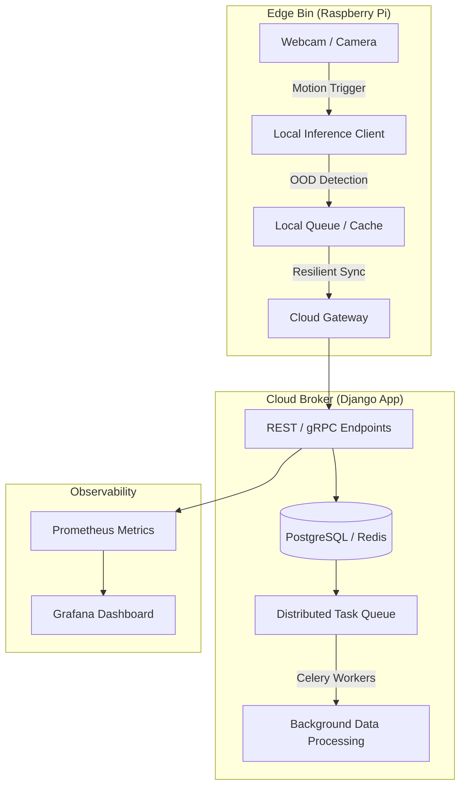

# WasteX Engineering Practice & Learning Roadmap

This document outlines a structured, 1-month learning and implementation roadmap for your work on [WasteX](file:///c:/WASTE/wastex). It is specifically designed to help you build **engineering significance** in **Backend Engineering** and **Machine Learning Systems (MLOps)**.

---

## 🗺️ Architectural Context of WasteX

WasteX uses a split-site architecture where Edge nodes run real-time inference, and a central Cloud Broker aggregates data. To turn this from a prototype into a production-grade ML system, we will focus on **scalability**, **resiliency**, **observability**, and **model efficiency**.

---

## 🚀 Module 1: Production-Grade Backend Architectures

### 1. Swapping Threading for a Distributed Task Queue (Celery + Redis)
- **Why it has Engineering Significance**: 
  In Python backend systems, running long-running operations inside web request-response threads causes worker timeouts, blocks incoming traffic, and leaks memory. Production systems use task queues.
- **Your Task**:
  - Replace the current threading logic with **Celery**.
  - Configure **Redis** or **RabbitMQ** as the message broker.
  - Implement task status persistence, worker pool concurrency limits, and failure callbacks.
  - Write unit tests for asynchronous task states.

### 2. Real-time Progress Tracking (WebSockets vs. Long-polling)
- **Why it has Engineering Significance**:
  Constantly polling creates unnecessary database reads and network overhead. Event-driven push is the standard for modern dashboards.
- **Your Task**:
  - Integrate **Django Channels** (WebSockets) or Server-Sent Events (SSE).
  - Stream background task metrics and status updates directly from the Celery worker to the client UI.
  - Handle client connection state changes and channel groups.

---

## 🧠 Module 2: Edge Inference & Model Optimization

### 1. TensorFlow Lite (TFLite) or ONNX Runtime Inference
- **Why it has Engineering Significance**:
  A full TensorFlow/Keras installation consumes over **500MB of RAM** and is extremely slow on CPUs or resource-constrained edge devices (like Raspberry Pis). ML Systems engineers must optimize models for target hardware.
- **Your Task**:
  - Write a model conversion script to export the trained `.keras` models to **TFLite** (quantized to float16 or int8) and **ONNX** formats.
  - Rewrite [model_loader.py](file:///c:/WASTE/wastex/classifier/model_loader.py) to load `tflite_runtime` or `onnxruntime` instead of standard `tensorflow`.
  - Profile the inference loop: Measure and compare **RAM footprint**, **CPU utilization**, and **Inference Latency** (ms) between raw Keras, ONNX, and Quantized TFLite.

### 2. Edge-Side Image Batching
- **Why it has Engineering Significance**:
  If a bin detects multiple pieces of waste in rapid succession, running inference synchronously on single images can bottleneck the queue.
- **Your Task**:
  - Implement a batching queue in [image_watcher.py](file:///c:/WASTE/wastex/pi/scripts/image_watcher.py) that batches incoming frames and runs batch inference (e.g., batch size 4 or 8) to leverage SIMD vectorization.

---

## 🔄 Module 3: MLOps and Data Lifecycle Management

### 1. Robust Metadata Logging and Experiment Registry
- **Why it has Engineering Significance**:
  In ML systems, reproducibility is everything. You must track exactly which dataset version, hyperparameters, and code commit produced a specific model binary.
- **Your Task**:
  - Expand the [TrainingRun](file:///c:/WASTE/wastex/classifier/models.py#L449) model or integrate **MLflow** to log all experiment details.
  - Save confusion matrices, precision-recall curves, and ROC curve plots as static assets tied to the run record.
  - Implement a basic "Model Registry" state machine: `Candidate` -> `Staging` -> `Production` -> `Archived`.

### 2. Fine-grained Evaluation and Slice Analysis
- **Why it has Engineering Significance**:
  Overall metrics (e.g., 90% accuracy) often mask critical failures in subset populations. For instance, a model might perform perfectly on Plastic but fail catastrophically on Glass under low-light conditions.
- **Your Task**:
  - Modify [evaluate.py](file:///c:/WASTE/wastex/training/evaluate.py) to perform "slice analysis."
  - Compute performance metrics broken down by:
    - **Edge Bin location / ID** (uncovering environment-specific bias).
    - **Image characteristics** (e.g., resolution, brightness).
  - Save these reports to help operators understand where the model is weak before promoting it.

---

## 🌐 Module 4: Distributed Systems & Network Resilience

### 1. Local Persistence Queue on Edge Nodes
- **Why it has Engineering Significance**:
  Edge devices operate on unreliable networks. If the Wi-Fi drops, the current [image_watcher.py](file:///c:/WASTE/wastex/pi/scripts/image_watcher.py) will fail uploads and potentially drop data.
- **Your Task**:
  - Re-engineer the Pi upload client to use a local **SQLite-backed write-ahead queue** or a lightweight message broker (like **MQTT** via Mosquitto).
  - When an image is captured, store it locally first.
  - Implement an asynchronous background sync thread that reads from SQLite, attempts transmission, and deletes the record only upon receiving a `200 OK` from the broker.
  - Implement **exponential backoff with jitter** to prevent thundering-herd problems when the network reconnects.

### 2. High-Performance APIs (gRPC / Protocol Buffers)
- **Why it has Engineering Significance**:
  REST/JSON payloads are verbose and slow to serialize. For large scale video/image metadata sync, gRPC reduces CPU utilization and payload size.
- **Your Task**:
  - Define a Protobuf schema for telemetry transfer (image metadata, class detections, health stats).
  - Create a secondary gRPC endpoint on the Django/Python broker to ingest telemetry.
  - Measure network bandwidth savings compared to standard REST/JSON endpoints.

---

## 🔒 Module 5: Reliability, Security, & Observability

### 1. Prometheus Telemetry and Dashboard Observability
- **Why it has Engineering Significance**:
  You cannot manage what you cannot measure. Monitoring ML endpoints (inference throughput, error rates, model confidence scores, drift alerts) is crucial.
- **Your Task**:
  - Expose a Prometheus metrics endpoint (using `django-prometheus` or custom instrumentation).
  - Track:
    - `inference_latency_seconds_bucket` (distribution of inference times).
    - `ood_detection_count_total` (frequency of anomalies).
    - `active_edge_bins_count` (heartbeat monitoring).
  - Write a `docker-compose` setup hosting Prometheus & Grafana, and design a custom dashboard.

### 2. Scoped API Key Authentication and Rate Limiting
- **Why it has Engineering Significance**:
  Edge nodes are physically exposed. If an attacker gains physical access to a Pi, they can extract its API token.
- **Your Task**:
  - Move away from static Django user tokens to scoped, expirable API Keys (e.g., using `djangorestframework-api-key`).
  - Restrict keys on a per-bin basis: a key for `bin_cafeteria` can *only* post telemetry to its own endpoint and cannot read dataset tables.
  - Implement API rate limiting using **Redis** to prevent compromised edge devices from flooding the broker.

---

## 📆 Recommended 4-Week Timeline

| Week | Focus Area | Core Technologies | Target Outcome |
| :--- | :--- | :--- | :--- |
| **Week 1** | **Backend Pipeline & Task Queuing** | Django, Celery, Redis, WebSockets | Heavy background tasks run reliably with real-time UI logs. |
| **Week 2** | **Edge Optimization & Inference** | ONNX Runtime, TFLite, Profiling | Inference runs 5x faster, consumes 10x less RAM, and is ready for Raspberry Pi CPUs. |
| **Week 3** | **Edge Resilience & gRPC** | SQLite, MQTT, Protobuf, gRPC | Telemetry is queued locally when offline; sync is highly optimized for bandwidth. |
| **Week 4** | **Observability & MLOps Polish** | Prometheus, Grafana, MLflow, API Scopes | Complete dashboards track model performance, logs, security scopes, and drift alerts. |

---
> [!TIP]
> **Suggested Start**: Pick **Week 1 (Celery + Redis task queue)** as your first project. It is the cornerstone of backend engineering and immediately solves a bottleneck in WasteX's dashboard.
